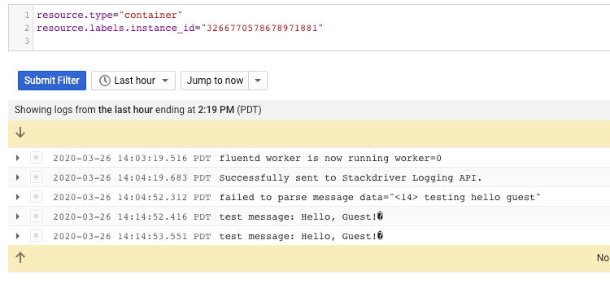

# Using Apigee Message Logger with fluentd

Use the [Message Logger](https://docs.apigee.com/api-platform/reference/policies/message-logging-policy) policy to log messages to [fluentd](https://docs.fluentd.org/).

## Scenario

Apigee's Message Logger policy allows users to forward log messages (parts or whole of the request and/or response) to a remote syslog server (or the file system in Apigee Private Cloud). Enterprises may have Splunk or Dynatrace as their logging standard and want to integrate Apigee Message Logger with such standards. 

Fluentd is an open source data collector for unified logging layer and has a rich set of [plugins](https://www.fluentd.org/plugins/all) that allows enterprises to integrate with. This example will show how to setup fluentd to consume messages from Message Logger.

### fluentd setup

Here is the sample configuration used for [fluentd](./fluentd-logger.yaml). The configuration for fluentd is stored in a ConfigMap with the following details:

```
    # Takes the messages sent over UDP
    <source>
      @type syslog
      tag apigee
      port 5140
      bind 0.0.0.0
      <parse>
        message_format rfc5424
      </parse>
    </source>
    <match apigee.**>
       @type stdout
    </match>
```

This configuration listens on UDP on port 5140. Install the fluentd service with the command:

```
kubectl apply -f fluentd-logger.yaml
```

### Message Logger Policy

Configure the Message Logger policy to send syslog events to the fluentd service. A sample API proxy is included [here](./apiproxy)

```
<MessageLogging async="false" continueOnError="false" enabled="true" name="Log-Message">
    <DisplayName>Log Message</DisplayName>
    <Syslog>
        <Message>Response message: {response.content}</Message>
        <Host>apigee-fluentd.apps.svc.cluster.local</Host>
        <Port>5140</Port>
        <FormatMessage>true</FormatMessage>
    </Syslog>
</MessageLogging>
```

### Output

If the setup was successful, you will see logs in fluentd's pod

Access the pod's log

```
kubectl logs -n apps apigee-fluentd-5bc99d9d9f-j9bb
```

OUTPUT:

```
20xx-xx-xx 00:41:45 +0000 [info]: starting fluentd-1.3.2 pid=6 ruby="2.5.2"
20xx-xx-xx 00:41:45 +0000 [info]: spawn command to main:  cmdline=["/usr/bin/ruby", "-Eascii-8bit:ascii-8bit", "/usr/bin/fluentd", "-c", "/fluentd/etc/fluent.conf", "-p", "/fluentd/plugins", "--under-supervisor"]
20xx-xx-xx 00:41:45 +0000 [info]: gem 'fluentd' version '1.3.2'
20xx-xx-xx 00:41:45 +0000 [info]: adding match pattern="apigee.**" type="stdout"
20xx-xx-xx 00:41:45 +0000 [info]: adding source type="syslog"
20xx-xx-xx 00:41:45 +0000 [info]: #0 starting fluentd worker pid=16 ppid=6 worker=0
20xx-xx-xx 00:41:45 +0000 [info]: #0 listening syslog socket on 0.0.0.0:5140 with udp
20xx-xx-xx 00:41:45 +0000 [info]: #0 fluentd worker is now running worker=0
20xx-xx-xx 00:41:56.849000000 +0000 apigee.user.info: {"host":"9178f6a4-6e9b-49d8-be5a-e9ac1af1a106","ident":"Apigee-Edge","pid":"-","msgid":"-","extradata":"-","message":"Response message: Hello, Guest!\u0000"}
```

### Stackdriver Logging

To send the Message Logger policy output to Stackdriver logs, use the google-fluentd image.

```
      containers:
      - name: fluentd
        image: google/apigee-stackdriver-logging-agent:1.6.8
```

Mount a service account with Log Write role.

```
kubectl create secret -n apps generic logging-svc-account --from-file client_secret.json
```

In the deployment spec:
```
      - name: svc-account-volume
        secret:
          defaultMode: 420
          secretName: logging-svc-account
```

Finally, change the fluentd configuration to look like:

```
  fluent.conf: |-  
    <source>
      @type syslog
      tag apigee
      port 5140
      bind 0.0.0.0
      <parse>
        message_format rfc5424
      </parse>
    </source>
    <filter **>
      @type add_insert_ids
      insert_id_key apigee-message-logger
    </filter>
    <match **>
      @type google_cloud
      project_id xxx
    </match>
```

#### Viewing the logs

Check the fluentd logs to see the instance Id for the logs:

Example:
```
20xx-xx-xx 21:03:19 +0000 [info]: adding match pattern="**" type="google_cloud"
20xx-xx-xx 21:03:19 +0000 [info]: #0 Detected GCE platform
20xx-xx-xx 21:03:19 +0000 [info]: #0 Logs viewer address: https://console.cloud.google.com/logs/viewer?project=xxxx&resource=container/instance_id/3266770578670000001
20xx-xx-xx 21:03:19 +0000 [info]: adding source type="syslog"
```

Open the link in your browser and view logs



Thank you [Sukruth](https://www.linkedin.com/in/sukruth-manjunath-809a598a) for helping with these intructions.

___

## Support

This is not an officially supported Google product
